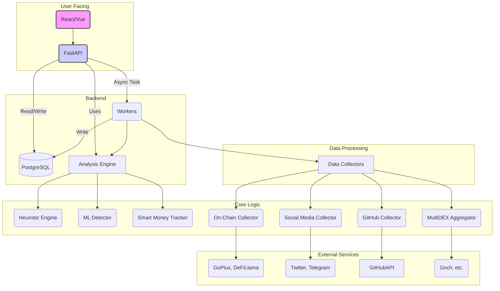
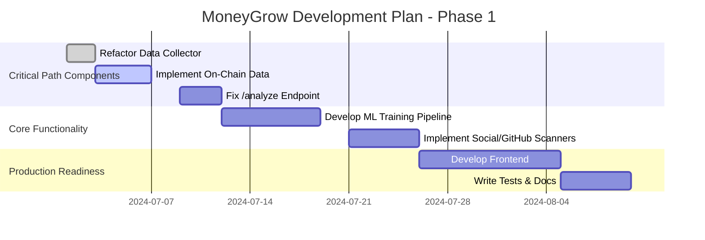
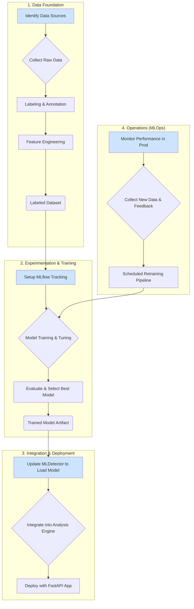

# MoneyGrow Platform Development Plan

## 1. Introduction

This document outlines the phased development plan to build the MoneyGrow platform from its current state into a production-ready application. The plan is based on the initial codebase analysis and prioritizes the most critical components to deliver a functional core, followed by advanced features and production-readiness tasks.

## 2. Target System Architecture

The following diagram illustrates the target architecture for the MoneyGrow platform, encompassing the frontend, backend, data processing layer, and external service integrations.

## 3. Development Timeline

This Gantt chart provides a high-level overview of the development timeline for the initial phases.

---

## 4. Phase 1: Solidify the Foundation (Critical Path)

The goal of this phase is to get real, reliable data flowing through the system and ensure the primary API endpoint is working correctly.

**1. Refactor the Data Collection Layer:**
   - **Action:** Modify the main `DataCollector` to use the superior `MultiDEXAggregator`. This will eliminate redundant code and centralize DEX interactions.
   - **Rationale:** This addresses the fragmentation noted in the analysis and is a prerequisite for reliable data gathering.

**2. Implement Real On-Chain Data Collection:**
   - **Action:** Replace all hardcoded and mock data in `collectors.py` and the placeholder modules with live data.
   - **Proposal:** We will integrate with a third-party service like **GoPlus Security API** for reliable honeypot, tax, and security analysis.
   - **Rationale:** This is the most critical step. Without accurate on-chain data, the entire analysis engine is useless.

**3. Fix and Enhance the `/analyze` Endpoint:**
   - **Action:**
     1.  Repair the caching mechanism in `src/api/main.py`.
     2.  Implement the `generate_enhanced_recommendations` function to provide actionable insights in the API response.
   - **Rationale:** This makes the core feature of the API functional and valuable.

---

## 5. Phase 2: Core Functionality - ML Pipeline Development

This phase focuses on creating a systematic, repeatable process for training, deploying, and maintaining our machine learning models.

### Detailed Breakdown:

**1. Data Foundation: Building the Dataset**
*   **Data Sources:** Identify sources for labeled data (scam and legitimate tokens) from community blacklists, rug pull databases, and curated lists of established projects.
*   **Collection & Feature Engineering:** Create scripts to pull raw on-chain data, contract source code, and transaction patterns. Develop a feature engineering module (`ml/training/feature_engineering.py`) to process this data into meaningful features.
*   **Labeling:** Label the collected data to form our ground-truth dataset.

**2. Experimentation: Training the Model**
*   **Tooling:** Use **MLflow** for experiment tracking, configured via `docker-compose.yml`.
*   **Training Pipeline:** Create a `ml/training/train.py` script to load data, apply feature engineering, train models (e.g., XGBoost), tune hyperparameters, and log all results to MLflow.
*   **Output:** The best-performing model will be versioned and saved to the `ml/models/` directory.

**3. Integration: Using the Model**
*   **Loading the Model:** Update `MLDetector` to load the trained model from the `ml/models/` directory.
*   **Inference:** The `MLDetector` will apply the same feature engineering to new data and use the model to generate a scam probability score.

**4. Operations: Keeping the Model Fresh**
*   **Monitoring:** Log model predictions and confidence scores to track performance and identify drift.
*   **Retraining:** Create a Celery task to trigger the training pipeline on new data, ensuring the model adapts over time.