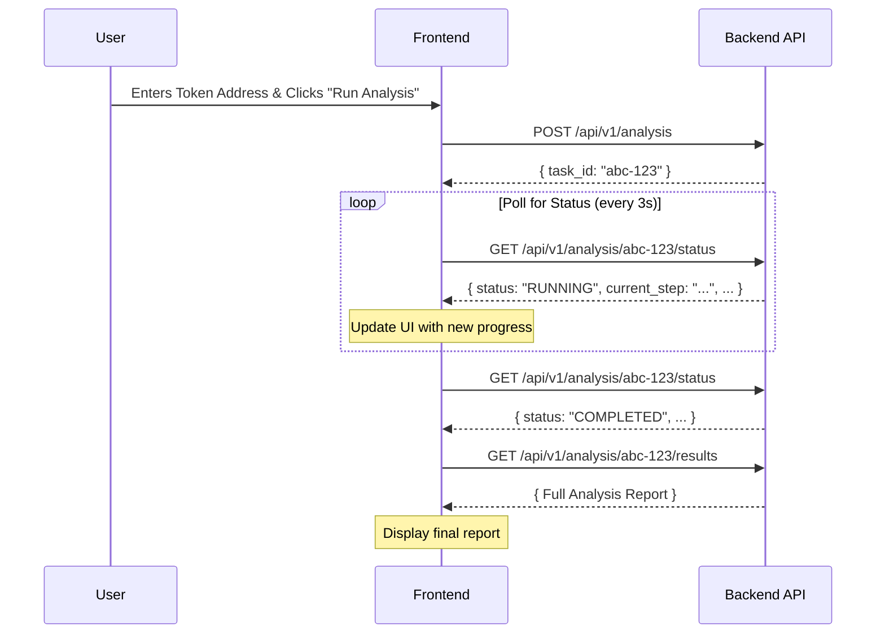

# **Architectural Plan: MoneyGrow Frontend & Asynchronous API**

This document outlines the complete architectural plan for the MoneyGrow user-facing application and the necessary backend API changes to support an interactive, real-time analysis experience.

## 1. Overall Architecture

The new architecture will shift from a synchronous request/response model to an asynchronous, task-based system. This is essential for the "Agent's Flow" concept, where the user can observe the analysis process in real-time.

Here is a high-level overview of the proposed system:

```mermaid
graph TD
    subgraph User's Browser
        A[Frontend Application]
    end

    subgraph Backend Services
        B[API Gateway (FastAPI)]
        C[Task Queue (Celery + Redis)]
        D[Analysis Workers]
        E[Application Database (PostgreSQL)]
    end

    subgraph Data & Analysis
        F[Data Collectors]
        G[Heuristic Engine]
        H[ML Detector]
        I[Smart Money Tracker]
    end

    A -- 1. POST /api/v1/analysis --> B
    B -- 2. Creates Task --> E[AnalysisTasks Table]
    B -- 3. Enqueues Job --> C
    B -- 4. Returns task_id --> A
    C -- 5. Dispatches Job --> D
    A -- 6. Polls GET /api/v1/analysis/{task_id}/status --> B
    B -- 7. Reads Status --> E
    D -- 8. Executes Steps --> F & G & H & I
    D -- 9. Updates Status --> E
    A -- 10. When complete, GET /api/v1/analysis/{task_id}/results --> B
    B -- 11. Fetches Final Report --> E
```

## 2. The "Agent's Flow": Defined Analysis Steps

To make the analysis process transparent, we will define a series of discrete steps. The backend will update the status after each step, and the frontend will display this progress to the user.

| Step Code                      | User-Facing Description          | Corresponds To                               |
| ------------------------------ | -------------------------------- | -------------------------------------------- |
| `INITIALIZING`                 | Initializing analysis...         | Task creation and validation.                |
| `FETCHING_DATA`                | Fetching on-chain & market data... | `DataCollector.collect_all_data()`           |
| `CHECKING_HONEYPOT`              | Checking for honeypot risks...   | `HeuristicEngine.check_honeypot()`           |
| `ANALYZING_LIQUIDITY`          | Analyzing liquidity pools...     | `HeuristicEngine.check_liquidity()`          |
| `VERIFYING_OWNERSHIP`          | Verifying contract ownership...  | `HeuristicEngine.check_ownership()`          |
| `ANALYZING_HOLDERS`            | Analyzing holder distribution... | `HeuristicEngine.check_holder_distribution()`|
| `EVALUATING_CONTRACT_SAFETY`   | Evaluating contract safety...    | `HeuristicEngine.check_contract_safety()`    |
| `RUNNING_ML_DETECTION`         | Applying machine learning model...| `MLScamDetector.predict_scam_probability()`  |
| `TRACKING_SMART_MONEY`         | Tracking smart money flow...     | `SmartMoneyTracker.analyze_smart_money_flow()`|
| `GENERATING_REPORT`            | Generating final report...       | Consolidating results and saving.            |
| `COMPLETED`                    | Analysis complete.               | The final state.                             |
| `FAILED`                       | Analysis failed.                 | Indicates an error occurred.                 |

## 3. Backend API Design

The existing synchronous `/analyze` endpoint will be replaced by a set of asynchronous endpoints.

### 3.1. New Database Model

A new table is required to track the state of each analysis task.

**`AnalysisTask` Model:**

*   `id` (UUID, Primary Key): The unique `task_id`.
*   `token_address` (String): The token being analyzed.
*   `chain_id` (Integer): The blockchain ID.
*   `status` (Enum: `PENDING`, `RUNNING`, `COMPLETED`, `FAILED`): The overall status of the task.
*   `current_step` (Enum: See Step Codes above): The specific step the agent is on.
*   `progress_percent` (Integer): A 0-100 value representing completion.
*   `intermediate_results` (JSONB): A field to store risks and findings as they are discovered.
*   `final_analysis_id` (ForeignKey to `TokenAnalysis`): Links to the final report once completed.
*   `created_at` (DateTime): Task creation timestamp.
*   `updated_at` (DateTime): Timestamp of the last status update.

### 3.2. API Endpoints & Schemas

#### **1. Start Analysis**

*   **Endpoint:** `POST /api/v1/analysis`
*   **Description:** Submits a new token for analysis and creates a task.
*   **Request Body:** `TokenAnalysisRequest`
*   **Response Body:** `AnalysisTaskInfo`

```python
# Pydantic Schema for Response
class AnalysisTaskInfo(BaseModel):
    task_id: UUID
    status: str # e.g., "PENDING"
    token_address: str
    chain_id: int
    created_at: datetime
```

#### **2. Get Analysis Status**

*   **Endpoint:** `GET /api/v1/analysis/{task_id}/status`
*   **Description:** Polled by the frontend to get progress updates.
*   **Response Body:** `AnalysisStatus`

```python
# Pydantic Schema for Response
class AnalysisStatus(BaseModel):
    task_id: UUID
    status: str # PENDING, RUNNING, COMPLETED, FAILED
    current_step: str # e.g., "ANALYZING_LIQUIDITY"
    progress_percent: int
    intermediate_risks: List[Risk] # Shows risks found so far
    updated_at: datetime
```

#### **3. Get Analysis Results**

*   **Endpoint:** `GET /api/v1/analysis/{task_id}/results`
*   **Description:** Fetches the final, complete report. Should only be called when the status is `COMPLETED`.
*   **Response Body:** `TokenAnalysisResponse`

## 4. Frontend Design

### 4.1. Wireframe / Component Layout

The main analysis page will be clean and focused, guiding the user through the process.



### 4.2. Component Breakdown

*   **`AnalysisInput.vue`**: A simple form with an input for the token address, a dropdown for the chain, and the "Run Analysis" button. On submission, it calls the `POST /api/v1/analysis` endpoint and passes the `task_id` to the parent view.
*   **`AgentProgressTracker.vue`**:
    *   Accepts the `AnalysisStatus` object as a prop.
    *   Displays a list of all potential steps from the "Agent's Flow".
    *   Uses icons and styling to show which steps are pending, in-progress, and completed.
    *   Displays the `intermediate_risks` as they are found, giving the user immediate feedback.
*   **`FinalReport.vue`**:
    *   Accepts the `TokenAnalysisResponse` object as a prop.
    *   Renders the full, detailed report, including the overall risk score, all heuristic risks, ML predictions, and smart money analysis.